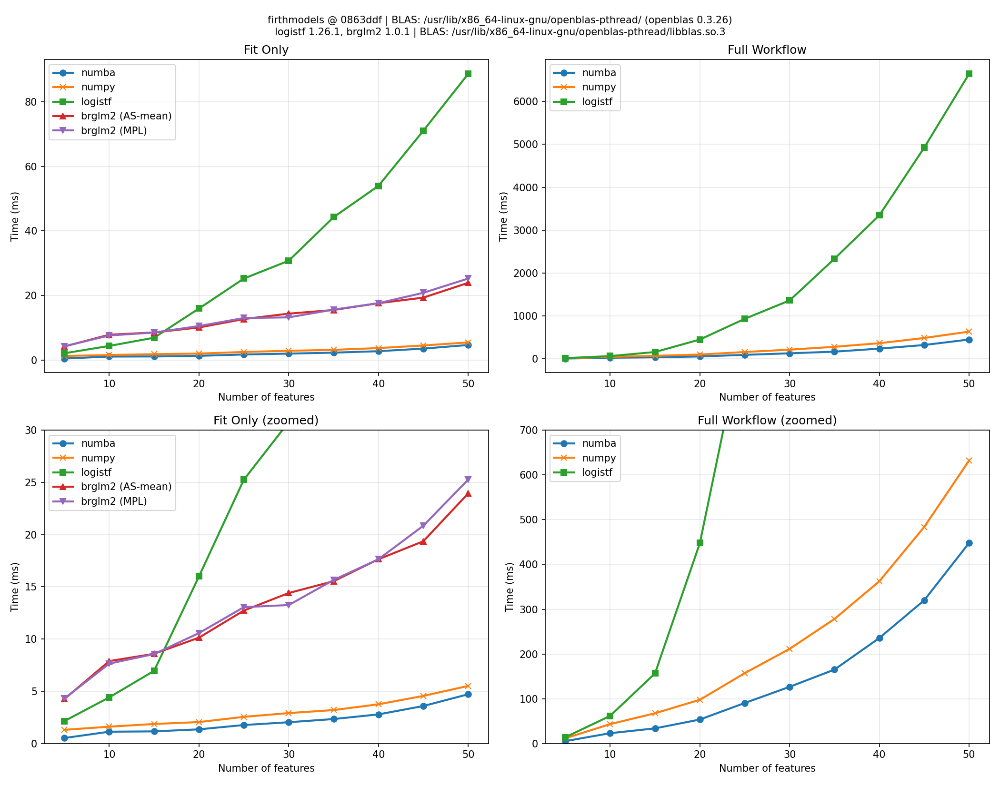
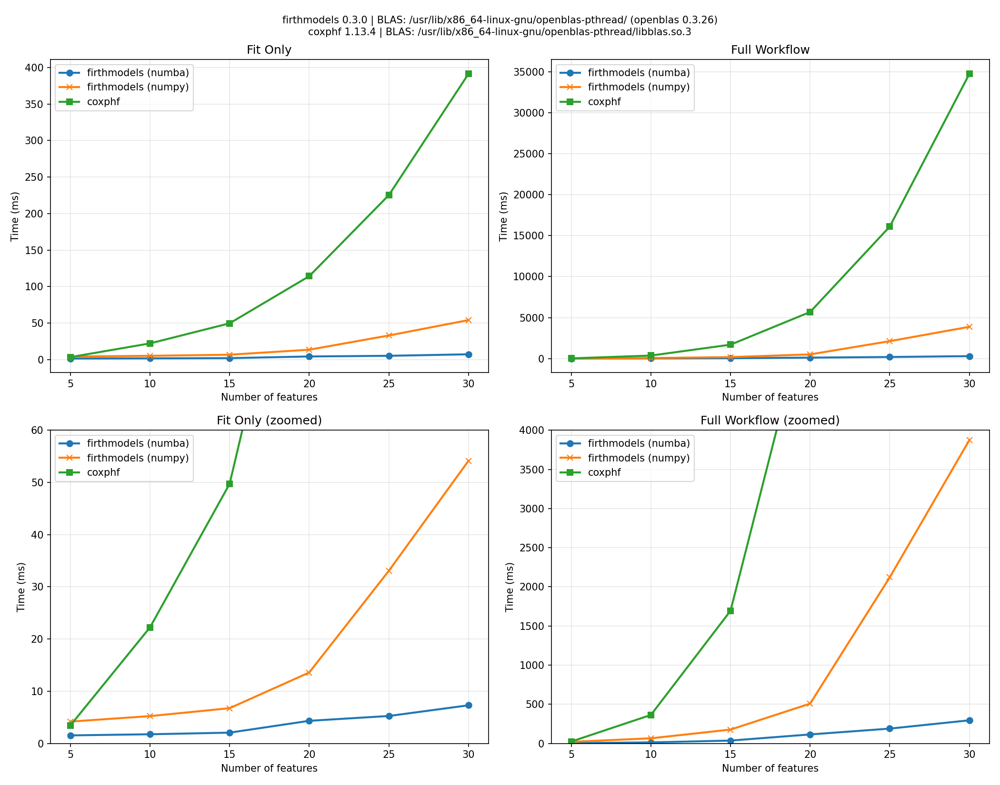

# Benchmarks

Benchmarking of implementations of Firth-penalized logistic regression and Cox regression.

## Environment

| | |
|-----|-----|
| **OS** | Pop!_OS 24.04 LTS |
| **CPU** | AMD Ryzen 5 5600X 6-Core Processor |
| **Python** | 3.12.12 |
| **NumPy** | 2.3.5 |
| **SciPy** | 1.16.3 |
| **Numba** | 0.63.1 |
| **R** | 4.5.2 |

---

## Firth Logistic Regression

Comparison of [firthmodels](https://github.com/jzluo/firthmodels),
R [brglm2](https://cran.r-project.org/web/packages/brglm2/index.html),
and R [logistf](https://cran.r-project.org/web/packages/logistf/index.html)
for Firth-penalized logistic regression.

### Libraries Compared

| Library | Version | BLAS |
|---------|---------|------|
| **firthmodels** | 0.3.0 | /usr/lib/x86_64-linux-gnu/openblas-pthread/ (openblas 0.3.26) |
| **brglm2** | 1.0.1 | /usr/lib/x86_64-linux-gnu/openblas-pthread/libblas.so.3 |
| **logistf** | 1.26.1 | /usr/lib/x86_64-linux-gnu/openblas-pthread/libblas.so.3 |

### Configuration

| Parameter | Value |
|-----------|-------|
| Observations (n) | 1,000 |
| Event rate | 20% |
| Features (k) | 5, 10, 15, 20, 25, 30, 35, 40, 45, 50 |
| Runs per config | 20 |
| Solver max_iter | 50 |
| Solver tolerance | 1e-06 |

brglm2 runs with `check_aliasing=FALSE` since the benchmark data is guaranteed full rank.

All implementations agree within chosen tolerance (coefficients 1e-06, CIs 1e-06, p-values 1e-06).

### Results



#### Fit Only

Time to fit the model and perform Wald inference. Values are minimum time across runs in milliseconds.

| k | firthmodels<br>(numba) | firthmodels<br>(numpy) | brglm2<br>(AS-mean) | brglm2<br>(MPL_Jeffreys) | logistf |
|--:|------:|------:|------------:|-------------:|--------:|
|   5 | 0.5 | 1.3 | 4.2 | 4.2 | 2.0 |
|  10 | 1.1 | 1.6 | 7.3 | 8.4 | 4.3 |
|  15 | 1.2 | 1.8 | 8.0 | 9.1 | 6.9 |
|  20 | 1.4 | 2.0 | 9.4 | 9.6 | 15.6 |
|  25 | 1.7 | 2.5 | 11.7 | 13.0 | 24.2 |
|  30 | 1.9 | 2.6 | 12.6 | 12.5 | 29.8 |
|  35 | 2.1 | 3.0 | 14.8 | 14.9 | 42.1 |
|  40 | 2.6 | 3.5 | 16.6 | 16.7 | 53.5 |
|  45 | 3.5 | 4.3 | 18.5 | 18.6 | 70.3 |
|  50 | 4.1 | 5.2 | 24.2 | 23.1 | 85.5 |

#### Full Workflow (Fit + LRT + Profile CI)

Time to fit the model, compute penalized likelihood ratio test p-values for all coefficients, and profile likelihood confidence intervals.

| k | firthmodels<br>(numba) | firthmodels<br>(numpy) | logistf |
|--:|------:|------:|--------:|
|   5 | 5.1 | 11.3 | 13.6 |
|  10 | 22.8 | 43.4 | 82.3 |
|  15 | 34.1 | 67.4 | 157.4 |
|  20 | 54.3 | 99.1 | 449.5 |
|  25 | 91.3 | 160.7 | 921.3 |
|  30 | 126.6 | 206.2 | 1337.0 |
|  35 | 163.9 | 279.0 | 2294.7 |
|  40 | 234.5 | 365.5 | 3314.2 |
|  45 | 328.3 | 471.0 | 4844.6 |
|  50 | 454.9 | 631.1 | 6403.8 |


---

## Firth Cox Proportional Hazards

Comparison of [firthmodels](https://github.com/jzluo/firthmodels)
and [coxphf](https://cran.r-project.org/web/packages/coxphf/index.html)
for Firth-penalized Cox proportional hazards regression.

### Libraries Compared

| Library | Version | BLAS |
|---------|---------|------|
| **firthmodels** | 0.3.0 | /usr/lib/x86_64-linux-gnu/openblas-pthread/ (openblas 0.3.26) |
| **coxphf** | 1.13.4 | /usr/lib/x86_64-linux-gnu/openblas-pthread/libblas.so.3 |

### Configuration

| Parameter | Value |
|-----------|-------|
| Observations (n) | 500 |
| Event rate | 20% |
| Features (k) | 5, 10, 15, 20, 25, 30 |
| Runs per config | 10 |
| Solver max_iter | 50 |
| Solver xtol | 1e-06 |
| Solver gtol | 0.0001 |

All implementations agree within chosen tolerance (coefficients 1e-06, CIs 1e-06, p-values 1e-06).

### Results



#### Fit Only

Time to fit the model and perform Wald inference. Values are minimum time across runs in milliseconds.

| k | firthmodels<br>(numba) | firthmodels<br>(numpy) | coxphf |
|--:|------:|------:|-------:|
|   5 | 1.5 | 4.2 | 3.4 |
|  10 | 1.8 | 5.2 | 22.2 |
|  15 | 2.1 | 6.7 | 49.7 |
|  20 | 4.3 | 13.6 | 114.3 |
|  25 | 5.3 | 33.1 | 225.3 |
|  30 | 7.3 | 54.1 | 391.3 |

#### Full Workflow (Fit + LRT + Profile CI)

Time to fit the model, compute penalized likelihood ratio test p-values for all coefficients, and profile likelihood confidence intervals.

| k | firthmodels<br>(numba) | firthmodels<br>(numpy) | coxphf |
|--:|------:|------:|-------:|
|   5 | 4.4 | 19.9 | 23.7 |
|  10 | 12.9 | 65.3 | 363.5 |
|  15 | 36.2 | 176.7 | 1694.1 |
|  20 | 114.7 | 508.2 | 5680.2 |
|  25 | 189.1 | 2122.0 | 16105.8 |
|  30 | 295.1 | 3875.0 | 34743.9 |


---

## Reproducing These Results

```bash
# Run logistic regression benchmarks
python benchmarks/benchmark_logistic.py \
    --csv benchmarks/logistic_results.csv \
    --plot benchmarks/logistic_report.png \
    --n-runs 30

# Run Cox PH benchmarks
python benchmarks/benchmark_cox.py \
    --csv benchmarks/cox_results.csv \
    --plot benchmarks/cox_report.png \
    --n-runs 15

# Regenerate this README
python benchmarks/generate_readme.py
```
