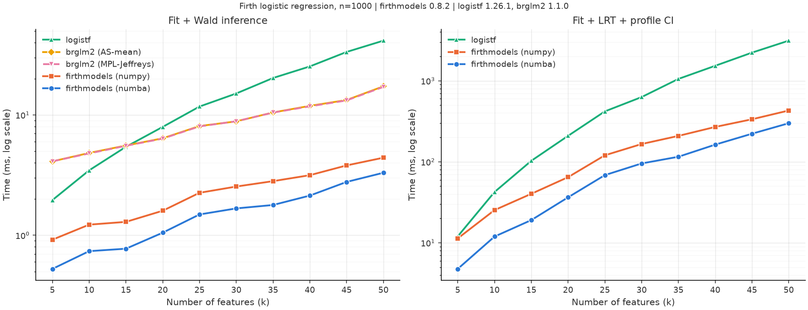
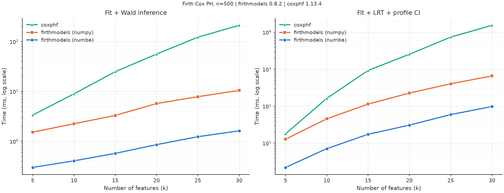

# Benchmarks

Benchmarking of implementations of Firth-penalized logistic regression and Cox regression.

## Environment

| | |
|-----|-----|
| **OS** | Pop!_OS 24.04 LTS |
| **CPU** | AMD Ryzen 5 5600X 6-Core Processor |
| **Python** | 3.12.12 |
| **NumPy** | 2.3.5 |
| **SciPy** | 1.16.3 |
| **Numba** | 0.64.0 |
| **R** | 4.5.2 |

---

## Firth Logistic Regression

Comparison of [firthmodels](https://github.com/jzluo/firthmodels),
R [brglm2](https://cran.r-project.org/web/packages/brglm2/index.html),
and R [logistf](https://cran.r-project.org/web/packages/logistf/index.html)
for Firth-penalized logistic regression.

### Libraries Compared

| Library | Version | BLAS |
|---------|---------|------|
| **firthmodels** | 0.7.2 | /usr/lib/x86_64-linux-gnu/openblas-pthread/ (openblas 0.3.26) |
| **brglm2** | 1.0.1 | /usr/lib/x86_64-linux-gnu/openblas-pthread/libblas.so.3 |
| **logistf** | 1.26.1 | /usr/lib/x86_64-linux-gnu/openblas-pthread/libblas.so.3 |

### Configuration

| Parameter | Value |
|-----------|-------|
| Observations (n) | 1,000 |
| Event rate | 20% |
| Features (k) | 5, 10, 15, 20, 25, 30, 35, 40, 45, 50 |
| Runs per config | 20 |
| Solver max_iter | 50 |
| Solver tolerance | 1e-06 |

brglm2 runs with `check_aliasing=FALSE` since the benchmark data is guaranteed full rank.

All implementations agree within chosen tolerance (coefficients 1e-06, CIs 1e-06, p-values 1e-06).

### Results



#### Fit Only

Time to fit the model and perform Wald inference. Values are minimum time across runs in milliseconds.

| k | firthmodels<br>(numba) | firthmodels<br>(numpy) | brglm2<br>(AS-mean) | brglm2<br>(MPL_Jeffreys) | logistf |
|--:|------:|------:|------------:|-------------:|--------:|
|   5 | 0.5 | 1.4 | 4.2 | 4.2 | 2.0 |
|  10 | 1.2 | 1.9 | 7.9 | 7.2 | 4.3 |
|  15 | 1.2 | 1.9 | 8.2 | 8.2 | 7.6 |
|  20 | 1.5 | 2.3 | 9.3 | 9.4 | 15.7 |
|  25 | 1.8 | 2.7 | 11.7 | 11.7 | 24.2 |
|  30 | 2.1 | 2.9 | 12.6 | 12.9 | 30.2 |
|  35 | 2.3 | 3.4 | 14.9 | 14.8 | 42.0 |
|  40 | 2.8 | 3.8 | 16.9 | 16.8 | 52.7 |
|  45 | 3.9 | 4.6 | 18.6 | 19.8 | 70.3 |
|  50 | 4.5 | 5.8 | 23.9 | 24.2 | 86.0 |

#### Full Workflow (Fit + LRT + Profile CI)

Time to fit the model, compute penalized likelihood ratio test p-values for all coefficients, and profile likelihood confidence intervals.

| k | firthmodels<br>(numba) | firthmodels<br>(numpy) | logistf |
|--:|------:|------:|--------:|
|   5 | 4.9 | 10.6 | 13.6 |
|  10 | 21.0 | 43.1 | 72.1 |
|  15 | 32.6 | 68.1 | 157.6 |
|  20 | 59.6 | 109.7 | 452.6 |
|  25 | 98.5 | 175.4 | 931.5 |
|  30 | 131.6 | 226.1 | 1350.4 |
|  35 | 184.0 | 312.7 | 2322.4 |
|  40 | 237.0 | 379.7 | 3334.4 |
|  45 | 358.4 | 519.7 | 4692.8 |
|  50 | 490.5 | 700.5 | 6501.0 |


---

## Firth Cox Proportional Hazards

Comparison of [firthmodels](https://github.com/jzluo/firthmodels)
and [coxphf](https://cran.r-project.org/web/packages/coxphf/index.html)
for Firth-penalized Cox proportional hazards regression.

### Libraries Compared

| Library | Version | BLAS |
|---------|---------|------|
| **firthmodels** | 0.7.2 | /usr/lib/x86_64-linux-gnu/openblas-pthread/ (openblas 0.3.26) |
| **coxphf** | 1.13.4 | /usr/lib/x86_64-linux-gnu/openblas-pthread/libblas.so.3 |

### Configuration

| Parameter | Value |
|-----------|-------|
| Observations (n) | 500 |
| Event rate | 20% |
| Features (k) | 5, 10, 15, 20, 25, 30 |
| Runs per config | 10 |
| Solver max_iter | 50 |
| Solver xtol | 1e-06 |
| Solver gtol | 0.0001 |

All implementations agree within chosen tolerance (coefficients 1e-06, CIs 1e-06, p-values 1e-06).

### Results



#### Fit Only

Time to fit the model and perform Wald inference. Values are minimum time across runs in milliseconds.

| k | firthmodels<br>(numba) | firthmodels<br>(numpy) | coxphf |
|--:|------:|------:|-------:|
|   5 | 1.8 | 4.3 | 3.5 |
|  10 | 1.8 | 5.5 | 22.2 |
|  15 | 2.2 | 7.1 | 49.9 |
|  20 | 4.5 | 14.7 | 113.9 |
|  25 | 5.9 | 35.9 | 225.5 |
|  30 | 8.4 | 69.4 | 391.0 |

#### Full Workflow (Fit + LRT + Profile CI)

Time to fit the model, compute penalized likelihood ratio test p-values for all coefficients, and profile likelihood confidence intervals.

| k | firthmodels<br>(numba) | firthmodels<br>(numpy) | coxphf |
|--:|------:|------:|-------:|
|   5 | 4.4 | 18.2 | 23.8 |
|  10 | 11.8 | 58.9 | 364.4 |
|  15 | 32.9 | 159.1 | 1693.6 |
|  20 | 105.3 | 473.2 | 5675.5 |
|  25 | 173.4 | 2240.4 | 16062.0 |
|  30 | 265.9 | 3846.8 | 34707.3 |


---

## Reproducing These Results

```bash
# Run logistic regression benchmarks
python benchmarks/benchmark_logistic.py -o benchmarks/logistic_results.csv

# Run Cox PH benchmarks
python benchmarks/benchmark_cox.py -o benchmarks/cox_results.csv

# Generate plots and README
python benchmarks/generate_report.py
```
